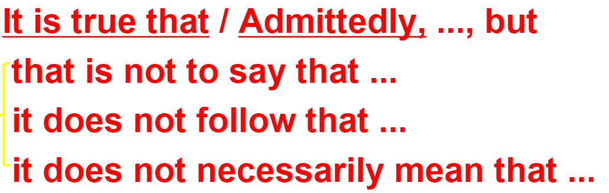

>It was true that he had just bought a lamb,he explained,but his lamb was black.

**It is true that**
It is true that ...,but
Admittedly,..,but



```It is true that many college students choose to pursue their graduate studies,but it does not necessarily mean that they want to be scholars.```

